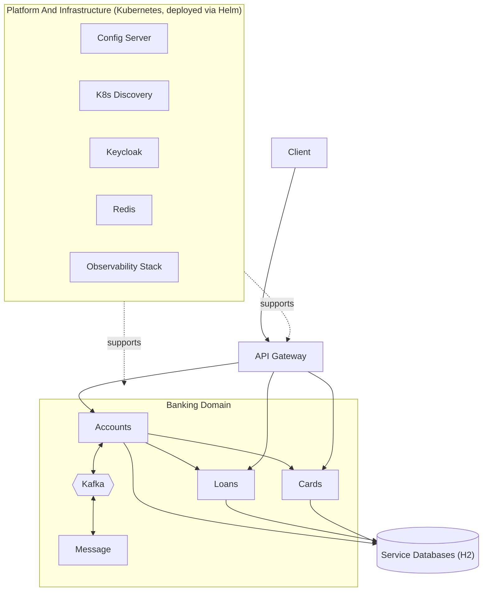
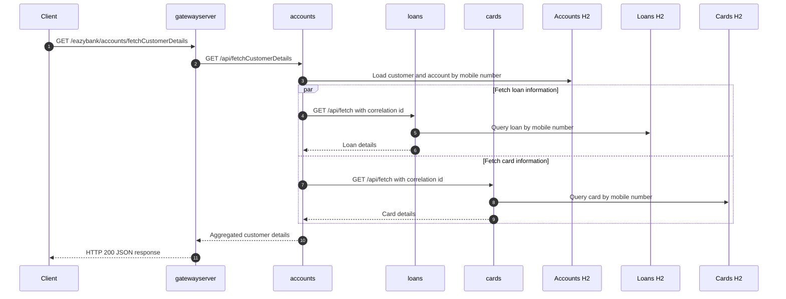
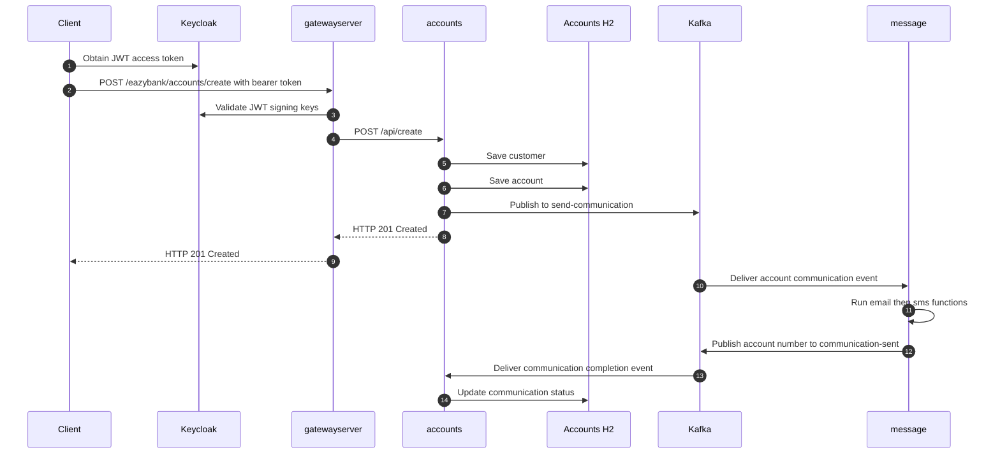
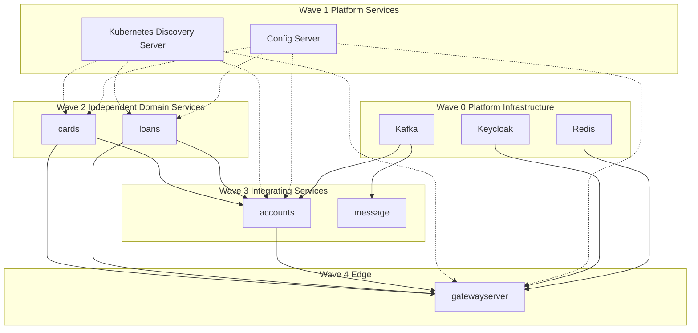
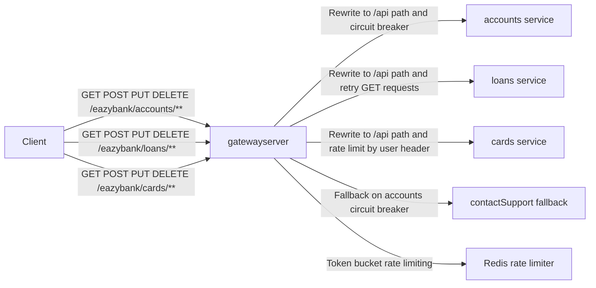
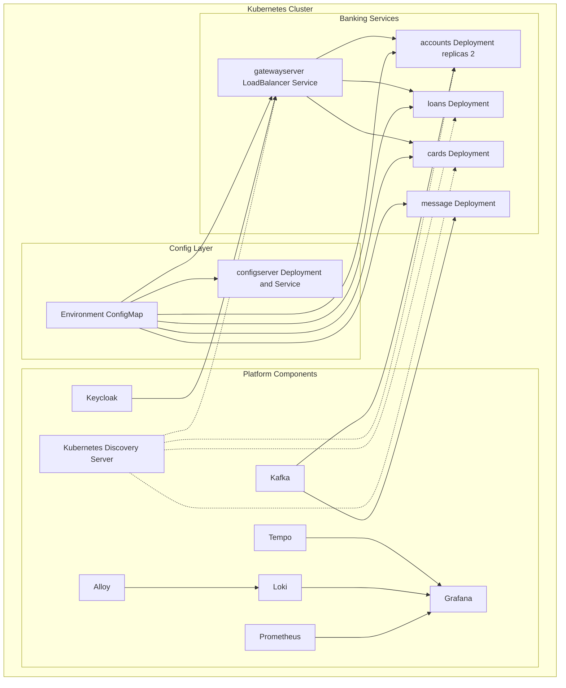
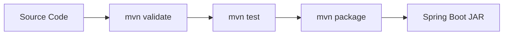

# EazyBank Microservices Banking Application

EazyBank is a production-style banking microservices application built with Java 21, Spring Boot 4, Spring Cloud, Spring Cloud Gateway, Spring Cloud Config, Kafka, Kubernetes, Helm, Keycloak, Redis, and an observability stack based on OpenTelemetry, Prometheus, Grafana, Loki, Tempo, and Alloy.

The repository demonstrates how a banking domain can be decomposed into independently deployable services while still supporting centralized configuration, API gateway routing, service-to-service communication, asynchronous messaging, resilience patterns, authentication and authorization, and Kubernetes-first deployment.

## Table Of Contents

- [What This Repository Contains](#what-this-repository-contains)
- [Core Features](#core-features)
- [Architecture Overview](#architecture-overview)
- [Service Catalog](#service-catalog)
- [Technology Stack](#technology-stack)
- [Repository Structure](#repository-structure)
- [How The Application Works](#how-the-application-works)
- [API Gateway, Security, And Routing](#api-gateway-security-and-routing)
- [Configuration Management](#configuration-management)
- [Messaging Pipeline](#messaging-pipeline)
- [Observability](#observability)
- [Local Development](#local-development)
- [Kubernetes And Helm Deployment](#kubernetes-and-helm-deployment)
- [Build, Image, And Deployment Pipelines](#build-image-and-deployment-pipelines)
- [API Reference](#api-reference)
- [Troubleshooting](#troubleshooting)
- [Security Notes Before Publishing](#security-notes-before-publishing)

## What This Repository Contains

This repository contains six standalone Spring Boot applications and Kubernetes/Helm deployment assets:

| Component | Type | Main Responsibility |
| --- | --- | --- |
| `accounts` | Spring Boot REST service | Customer and bank account APIs, customer detail aggregation, Kafka communication events |
| `loans` | Spring Boot REST service | Loan CRUD APIs |
| `cards` | Spring Boot REST service | Card CRUD APIs |
| `message` | Spring Cloud Stream service | Kafka-based email and SMS communication pipeline |
| `configserver` | Spring Cloud Config Server | Centralized external configuration backed by Git |
| `gatewayserver` | Spring Cloud Gateway service | Edge routing, JWT validation, authorization, retries, circuit breaking, rate limiting |
| `helm` | Helm charts | Kubernetes deployment charts for services and platform components |
| `kubernetes` | Raw Kubernetes manifests | Spring Cloud Kubernetes Discovery Server manifest |

There is no root Maven aggregator project. Each service is an independent Maven project with its own `pom.xml` and Maven Wrapper files.

## Core Features

- Customer and account management through the `accounts` service.
- Loan management through the `loans` service.
- Card management through the `cards` service.
- Customer profile aggregation where `accounts` fetches loan and card information through OpenFeign.
- API gateway routing through `/eazybank/accounts/**`, `/eazybank/loans/**`, and `/eazybank/cards/**`.
- Centralized configuration through Spring Cloud Config Server.
- Git-backed configuration using `https://github.com/eazybytes/eazybytes-config.git`.
- Kafka event flow for account communication notifications.
- Message processing service that composes `email` and `sms` functions.
- Gateway-level OAuth2 resource server support with Keycloak JWT validation.
- Role-based access rules for account, card, and loan routes.
- Resilience4j circuit breaker, retry, and rate limiting patterns.
- Redis-backed request rate limiting on card routes.
- H2 in-memory databases for domain services.
- Actuator endpoints, health probes, Prometheus metrics, and trace-aware logging.
- Kubernetes deployment with Helm environment charts for dev, QA, and production.
- OpenTelemetry Java agent configuration for distributed tracing.
- Grafana, Prometheus, Loki, Tempo, and Alloy charts for observability.

## Architecture Overview

The application uses a gateway-first architecture. Clients call the gateway, the gateway validates security and routes traffic to the correct internal service, and the domain services communicate through REST and Kafka where appropriate.

### Simple Overview

This simplified view shows the main request path, Kubernetes deployment layer, and the major supporting platform components without every operational detail.



### In-Depth Architecture

```mermaid
flowchart TB
  client["Client or API Consumer"]

  subgraph identityPlatform ["Identity"]
    keycloak["Keycloak JWT Issuer"]
  end

  subgraph edgeLayer ["Edge Layer"]
    gateway["gatewayserver Spring Cloud Gateway"]
    redis["Redis Rate Limiter"]
  end

  subgraph configLayer ["Configuration And Discovery"]
    configserver["configserver Spring Cloud Config on port 8071"]
    configGit["External Git Config Repository"]
    discovery["Spring Cloud Kubernetes Discovery Server"]
  end

  subgraph bankingServices ["Banking Domain Services"]
    accounts["accounts service on port 8080"]
    loans["loans service on port 8090"]
    cards["cards service on port 9000"]
  end

  subgraph dataStores ["Service Data Stores"]
    accountsDb["Accounts H2 Database"]
    loansDb["Loans H2 Database"]
    cardsDb["Cards H2 Database"]
  end

  subgraph messagingLayer ["Asynchronous Messaging"]
    kafka["Apache Kafka"]
    sendTopic["send-communication topic"]
    sentTopic["communication-sent topic"]
    messageService["message service on port 9010"]
  end

  subgraph observabilityLayer ["Observability"]
    otel["OpenTelemetry Java Agent"]
    prometheus["Prometheus"]
    tempo["Tempo Traces"]
    loki["Loki Logs"]
    alloy["Grafana Alloy"]
    grafana["Grafana Dashboards"]
  end

  client -->|"HTTP requests through load balancer"| gateway
  client -->|"Obtains access token"| keycloak
  gateway -->|"Validates JWT signing keys"| keycloak
  gateway -->|"Uses rate limiter for cards route"| redis

  gateway -->|"/eazybank/accounts/**"| accounts
  gateway -->|"/eazybank/loans/**"| loans
  gateway -->|"/eazybank/cards/**"| cards

  configserver -->|"Loads configuration"| configGit
  accounts -.->|"Optional config import"| configserver
  loans -.->|"Optional config import"| configserver
  cards -.->|"Optional config import"| configserver
  gateway -.->|"Optional config import"| configserver

  accounts -.->|"Kubernetes discovery client"| discovery
  loans -.->|"Kubernetes discovery client"| discovery
  cards -.->|"Kubernetes discovery client"| discovery
  gateway -.->|"Kubernetes discovery client"| discovery

  accounts --> accountsDb
  loans --> loansDb
  cards --> cardsDb

  accounts -->|"OpenFeign customer aggregation"| loans
  accounts -->|"OpenFeign customer aggregation"| cards

  accounts -->|"Publishes event"| sendTopic
  sendTopic --> kafka
  kafka --> messageService
  messageService -->|"Publishes completion"| sentTopic
  sentTopic --> kafka
  kafka -->|"Updates communication status"| accounts

  accounts -.-> otel
  loans -.-> otel
  cards -.-> otel
  gateway -.-> otel
  otel -.-> tempo
  alloy -.-> loki
  prometheus -.-> grafana
  tempo -.-> grafana
  loki -.-> grafana
```



## Service Catalog

### `configserver`

`configserver` is the centralized Spring Cloud Config Server.

- Main class: `com.eazybytes.configserver.ConfigserverApplication`
- Local port: `8071`
- Spring application name: `configserver`
- Active profile in local config: `git`
- Configuration backend: `https://github.com/eazybytes/eazybytes-config.git`
- Default Git label: `main`
- Kubernetes service type: `ClusterIP`
- Container image pattern: `eazybytes/configserver:s17`

The service can also be adapted to use the bundled classpath configuration files under `configserver/src/main/resources/config`, but the checked-in active profile points to the Git backend.

### `gatewayserver`

`gatewayserver` is the single entry point for client traffic.

- Main class: `com.eazybytes.gatewayserver.GatewayserverApplication`
- Framework: Spring Cloud Gateway Server WebFlux
- Security: Spring Security OAuth2 Resource Server
- JWT signing keys: configured through Keycloak JWK set URI
- Redis: used by the gateway rate limiter
- Resilience: circuit breaker, retry, and rate limiting
- Kubernetes exposure: `LoadBalancer`
- Helm service port: `8072`
- Container image pattern: `eazybytes/gatewayserver:s17`

The gateway routes traffic to the domain services through internal service names:

| Public Gateway Path | Internal Target | Gateway Behavior |
| --- | --- | --- |
| `/eazybank/accounts/**` | `http://accounts:8080` | Path rewrite, response timestamp header, circuit breaker, fallback |
| `/eazybank/loans/**` | `http://loans:8090` | Path rewrite, response timestamp header, GET retry |
| `/eazybank/cards/**` | `http://cards:9000` | Path rewrite, response timestamp header, Redis rate limiter |

### `accounts`

`accounts` owns customer and account data and coordinates richer banking views.

- Main class: `com.eazybytes.accounts.AccountsApplication`
- Local port: `8080`
- Database: H2 in-memory database
- API base path: `/api`
- Gateway prefix: `/eazybank/accounts`
- Synchronous dependencies: `loans` and `cards` through OpenFeign
- Asynchronous dependencies: Kafka producer and consumer through Spring Cloud Stream
- Container image pattern: `eazybytes/accounts:s17`
- Helm replica count: `2`

Primary responsibilities:

- Create, fetch, update, and delete accounts.
- Store customer data.
- Generate new account records.
- Fetch aggregated customer details by calling `loans` and `cards`.
- Publish account communication messages to Kafka.
- Consume communication completion events and update account communication status.

### `loans`

`loans` owns loan records for customers.

- Main class: `com.eazybytes.loans.LoansApplication`
- Local port: `8090`
- Database: H2 in-memory database
- API base path: `/api`
- Gateway prefix: `/eazybank/loans`
- Container image pattern: `eazybytes/loans:s17`
- Kubernetes service type: `ClusterIP`

Primary responsibilities:

- Create a loan for a mobile number.
- Fetch loan details.
- Update loan details.
- Delete loan details.
- Expose build, Java version, and contact information endpoints.

### `cards`

`cards` owns card records for customers.

- Main class: `com.eazybytes.cards.CardsApplication`
- Local port: `9000`
- Database: H2 in-memory database
- API base path: `/api`
- Gateway prefix: `/eazybank/cards`
- Container image pattern: `eazybytes/cards:s17`
- Kubernetes service type: `ClusterIP`

Primary responsibilities:

- Create a card for a mobile number.
- Fetch card details.
- Update card details.
- Delete card details.
- Expose build, Java version, and contact information endpoints.

### `message`

`message` is a stream processing service for communication events.

- Main class: `com.eazybytes.message.MessageApplication`
- Local port: `9010`
- Framework: Spring Cloud Stream with Kafka binder
- Function definition: `email|sms`
- Input topic: `send-communication`
- Output topic: `communication-sent`
- Container image pattern: `eazybytes/message:s17`

The service receives an account communication payload, logs an email action, logs an SMS action, and returns the account number to the `communication-sent` topic.

## Technology Stack

### Backend And Platform

- Java `21`
- Spring Boot `4.0.0`
- Spring Cloud `2025.1.0`
- Spring Web MVC for domain services
- Spring WebFlux Gateway for the gateway service
- Spring Cloud Config Server and Config Client
- Spring Cloud Kubernetes Discovery Client
- Spring Cloud OpenFeign
- Spring Cloud Stream
- Apache Kafka
- Spring Security
- OAuth2 Resource Server
- Keycloak-compatible JWT validation
- Resilience4j
- Redis reactive client
- Spring Data JPA
- H2 database
- Jakarta Bean Validation
- Lombok
- Springdoc OpenAPI

### Build And Delivery

- Maven Wrapper per service
- Maven Surefire through standard Maven lifecycle
- Spring Boot Maven Plugin
- Google Jib Maven Plugin `3.5.1`
- Container image naming pattern: `eazybytes/${project.artifactId}:s17`
- Helm charts for services and platform components
- Kubernetes manifests for service discovery support

### Observability

- Spring Boot Actuator
- Micrometer Prometheus registry
- OpenTelemetry Java Agent `2.22.0`
- Prometheus
- Grafana
- Grafana Loki
- Grafana Tempo
- Grafana Alloy
- Trace-aware log pattern using `trace_id` and `span_id`

## Repository Structure

```text
.
|-- accounts/               # Customer and account service
|-- cards/                  # Cards service
|-- configserver/           # Spring Cloud Config Server
|-- gatewayserver/          # API Gateway and security edge
|-- loans/                  # Loans service
|-- message/                # Kafka stream processor
|-- helm/                   # Helm charts for services and infrastructure
|   |-- environments/       # dev, qa, and prod umbrella charts
|   |-- eazybank-common/    # Shared Helm templates
|   |-- eazybank-services/  # Per-service charts
|   |-- kafka/              # Kafka chart
|   |-- keycloak/           # Keycloak chart
|   |-- kube-prometheus/    # Prometheus chart
|   |-- grafana/            # Grafana chart
|   |-- grafana-loki/       # Loki chart
|   |-- grafana-tempo/      # Tempo chart
|   `-- grafana-alloy/      # Alloy chart
`-- kubernetes/
    `-- kubernetes-discoveryserver.yml
```

## How The Application Works

The system has three major runtime paths:

1. Synchronous HTTP requests through the gateway.
2. Synchronous service-to-service aggregation from `accounts` to `loans` and `cards`.
3. Asynchronous Kafka communication after account creation.

### Customer Details Aggregation

When a client requests full customer details, the gateway routes the call to the `accounts` service. `accounts` loads its own customer and account data, then calls `loans` and `cards` through Feign clients to build a combined response.



### Account Creation And Communication Flow

When a new account is created, `accounts` persists customer and account data and publishes a message to Kafka. The `message` service consumes the event, applies the `email|sms` function pipeline, and publishes the account number back to `communication-sent`. The `accounts` service consumes that completion event and updates the communication status.



### Startup Dependency Model

The services use optional Config Server imports, so a local service can still start if the Config Server is unavailable. For a complete realistic environment, start infrastructure first, then configuration/discovery, then domain services, then the gateway.



## API Gateway, Security, And Routing

The gateway declares its routes programmatically in `GatewayserverApplication`.



Security is configured in `SecurityConfig`.

- All HTTP `GET` requests are permitted by the first matcher.
- `/eazybank/accounts/**` requires role `ACCOUNTS` for non-GET requests.
- `/eazybank/cards/**` requires role `CARDS` for non-GET requests.
- `/eazybank/loans/**` requires role `LOANS` for non-GET requests.
- JWT authorities are converted through `KeycloakRoleConverter`.
- CSRF is disabled for this API gateway.

Local gateway security configuration points to:

```text
http://localhost:7080/realms/master/protocol/openid-connect/certs
```

In Kubernetes, the Helm environment values point to:

```text
http://keycloak.default.svc.cluster.local:80/realms/master/protocol/openid-connect/certs
```

## Configuration Management

`configserver` is the central configuration service. Its local `application.yml` activates the `git` profile and uses the public EazyBytes config repository:

```yaml
spring:
  profiles:
    active: git
  cloud:
    config:
      server:
        git:
          uri: "https://github.com/eazybytes/eazybytes-config.git"
          default-label: main
          timeout: 5
          clone-on-start: true
          force-pull: true
```

Domain services and the gateway use optional config imports:

```yaml
spring:
  config:
    import: "optional:configserver:http://localhost:8071/"
```

Because the import is optional, services are not hard-blocked from starting when the Config Server is unavailable. For a full environment, however, the Config Server should be available first so externalized properties are applied consistently.

The repository also contains bundled config examples under:

```text
configserver/src/main/resources/config/
```

Those files can support a native Config Server profile if the server is reconfigured from Git mode to native mode.

## Messaging Pipeline

The asynchronous communication pipeline uses Kafka and Spring Cloud Stream.

```mermaid
flowchart LR
  accountsCreate["accounts createAccount"]
  streamBridge["StreamBridge sendCommunication-out-0"]
  sendTopic["Kafka topic send-communication"]
  messageEmail["message email function"]
  messageSms["message sms function"]
  sentTopic["Kafka topic communication-sent"]
  accountsConsumer["accounts updateCommunication consumer"]
  accountsDb["Accounts H2 communication status"]

  accountsCreate --> streamBridge
  streamBridge --> sendTopic
  sendTopic --> messageEmail
  messageEmail --> messageSms
  messageSms --> sentTopic
  sentTopic --> accountsConsumer
  accountsConsumer --> accountsDb
```



`accounts` bindings:

```yaml
spring:
  cloud:
    function:
      definition: updateCommunication
    stream:
      bindings:
        updateCommunication-in-0:
          destination: communication-sent
          group: ${spring.application.name}
        sendCommunication-out-0:
          destination: send-communication
      kafka:
        binder:
          brokers:
            - localhost:9092
```

`message` bindings:

```yaml
spring:
  cloud:
    function:
      definition: email|sms
    stream:
      bindings:
        emailsms-in-0:
          destination: send-communication
          group: ${spring.application.name}
        emailsms-out-0:
          destination: communication-sent
```

## Observability

The services are instrumented with Spring Boot Actuator, Prometheus metrics, OpenTelemetry, and structured log patterns.

### Actuator And Metrics

Most services expose all actuator endpoints in their local configuration:

```yaml
management:
  endpoints:
    web:
      exposure:
        include: "*"
  metrics:
    tags:
      application: ${spring.application.name}
```

The Helm stack includes:

- `helm/kube-prometheus` for Prometheus.
- `helm/grafana` for dashboards.
- `helm/grafana-loki` for log storage.
- `helm/grafana-tempo` for traces.
- `helm/grafana-alloy` for collecting and forwarding telemetry.

### Tracing

The Maven projects include the OpenTelemetry Java agent dependency, and Helm global values configure the Java agent:

```yaml
openTelemetryJavaAgent: "-javaagent:/app/libs/opentelemetry-javaagent-2.22.0.jar"
otelExporterEndPoint: http://tempo.default.svc.cluster.local:4318
otelMetricsExporter: none
otelLogsExporter: none
```

Log patterns include trace and span IDs:

```yaml
logging:
  pattern:
    level: "%5p [${spring.application.name},%X{trace_id},%X{span_id}]"
```

## Local Development

### Prerequisites

Install the following tools for local development:

- JDK 21
- Git
- Docker Desktop or another container runtime, if you want to run Kafka, Redis, Keycloak, or local container images
- Maven is optional because each service includes Maven Wrapper scripts
- Kubernetes cluster, such as Docker Desktop Kubernetes, Minikube, Kind, or a cloud cluster, for Helm deployment
- Helm 3

### Build A Service

Each service is a standalone Maven project. Run commands from the service directory.

Windows PowerShell:

```powershell
cd accounts
.\mvnw.cmd clean package
```

Unix shell:

```bash
cd accounts
./mvnw clean package
```

Repeat for:

```text
configserver
accounts
loans
cards
message
gatewayserver
```

### Run A Service Locally

Windows PowerShell:

```powershell
cd configserver
.\mvnw.cmd spring-boot:run
```

Unix shell:

```bash
cd configserver
./mvnw spring-boot:run
```

Because this is a multi-service application, open a separate terminal for each service.

### Recommended Local Startup Order

1. Start infrastructure dependencies if you want the full runtime behavior:
   - Kafka on `localhost:9092`
   - Redis on `localhost:6379`
   - Keycloak on `localhost:7080`
2. Start `configserver` on `localhost:8071`.
3. Start `loans` on `localhost:8090`.
4. Start `cards` on `localhost:9000`.
5. Start `accounts` on `localhost:8080`.
6. Start `message` on `localhost:9010`.
7. Start `gatewayserver`.

Important local ports:

| Component | Local Port | Purpose |
| --- | --- | --- |
| `configserver` | `8071` | Centralized configuration |
| `accounts` | `8080` | Customer and account APIs |
| `loans` | `8090` | Loan APIs |
| `cards` | `9000` | Card APIs |
| `message` | `9010` | Kafka stream processor |
| Redis | `6379` | Gateway rate limiter |
| Kafka | `9092` | Communication topics |
| Keycloak | `7080` | Local JWT issuer and JWK endpoint |

Note: `gatewayserver/src/main/resources/application.yml` does not define a local `server.port`. The Helm chart exposes the gateway on port `8072`, and external configuration can also provide a gateway port. If running locally, verify the effective port in the startup logs or set `server.port=8072` explicitly.

### Useful Local URLs

```text
Config Server:
http://localhost:8071

Accounts:
http://localhost:8080

Loans:
http://localhost:8090

Cards:
http://localhost:9000

Message:
http://localhost:9010

Gateway through Helm:
http://localhost:8072
```

For Springdoc-enabled services, Swagger UI is typically available at:

```text
http://localhost:8080/swagger-ui.html
http://localhost:8090/swagger-ui.html
http://localhost:9000/swagger-ui.html
```

Depending on Springdoc routing, `/swagger-ui/index.html` may also be available.

## Kubernetes And Helm Deployment

The repository is Kubernetes-first for full-stack deployment. The `helm` directory contains service charts, environment umbrella charts, and infrastructure charts.

### Deployment Topology



### Environment Charts

The environment charts are:

```text
helm/environments/dev-env
helm/environments/qa-env
helm/environments/prod-env
```

Each environment chart depends on:

- `eazybank-common`
- `configserver`
- `accounts`
- `cards`
- `loans`
- `gatewayserver`
- `message`

The `dev-env` global values include:

```yaml
global:
  configMapName: eazybankdev-configmap
  activeProfile: default
  configServerURL: configserver:http://configserver:8071/
  discoveryServerURL: "http://spring-cloud-kubernetes-discoveryserver:80/"
  keyCloakURL: http://keycloak.default.svc.cluster.local:80/realms/master/protocol/openid-connect/certs
  openTelemetryJavaAgent: "-javaagent:/app/libs/opentelemetry-javaagent-2.22.0.jar"
  otelExporterEndPoint: http://tempo.default.svc.cluster.local:4318
  otelMetricsExporter: none
  otelLogsExporter: none
  kafkaBrokerURL: kafka-controller-0.kafka-controller-headless.default.svc.cluster.local:9092
```

### Deploy Discovery Server

Apply the Spring Cloud Kubernetes Discovery Server manifest before deploying services that depend on it:

```powershell
kubectl apply -f .\kubernetes\kubernetes-discoveryserver.yml
```

Unix shell:

```bash
kubectl apply -f ./kubernetes/kubernetes-discoveryserver.yml
```

The manifest creates:

- A `spring-cloud-kubernetes-discoveryserver` `ClusterIP` service.
- A service account.
- RBAC permissions to read services, endpoints, and pods.
- A deployment using `springcloud/spring-cloud-kubernetes-discoveryserver:3.2.0`.

### Deploy An Environment With Helm

From the repository root:

Windows PowerShell:

```powershell
cd helm\environments\dev-env
helm dependency update
helm install eazybank-dev . --namespace default
```

Unix shell:

```bash
cd helm/environments/dev-env
helm dependency update
helm install eazybank-dev . --namespace default
```

For QA or production, use the corresponding environment chart:

```powershell
cd helm\environments\qa-env
helm dependency update
helm install eazybank-qa . --namespace default
```

```powershell
cd helm\environments\prod-env
helm dependency update
helm install eazybank-prod . --namespace default
```

### Service Chart Image Defaults

| Service | Image | Kubernetes Service Type | Port |
| --- | --- | --- | --- |
| `configserver` | `eazybytes/configserver:s17` | `ClusterIP` | `8071` |
| `accounts` | `eazybytes/accounts:s17` | `ClusterIP` | `8080` |
| `loans` | `eazybytes/loans:s17` | `ClusterIP` | `8090` |
| `cards` | `eazybytes/cards:s17` | `ClusterIP` | `9000` |
| `message` | `eazybytes/message:s17` | `ClusterIP` | `9010` |
| `gatewayserver` | `eazybytes/gatewayserver:s17` | `LoadBalancer` | `8072` |

## Build, Image, And Deployment Pipelines

This repository currently contains Maven/Jib/Helm delivery assets. It does not currently contain GitHub Actions workflows, Jenkins pipelines, GitLab CI files, Docker Compose files, or Dockerfiles.

### Maven Build Pipeline

Each service follows the standard Maven lifecycle:



Build all services manually by running `clean package` in each service directory:

```powershell
cd configserver; .\mvnw.cmd clean package
cd ..\accounts; .\mvnw.cmd clean package
cd ..\loans; .\mvnw.cmd clean package
cd ..\cards; .\mvnw.cmd clean package
cd ..\message; .\mvnw.cmd clean package
cd ..\gatewayserver; .\mvnw.cmd clean package
```

Unix shell:

```bash
for service in configserver accounts loans cards message gatewayserver; do
  (cd "$service" && ./mvnw clean package)
done
```

### Jib Image Pipeline

Every service configures the Jib Maven Plugin with this image pattern:

```xml
<image>eazybytes/${project.artifactId}:s17</image>
```

Build and push an image to the configured remote registry:

```powershell
cd accounts
.\mvnw.cmd compile jib:build
```

Build an image into a local Docker daemon:

```powershell
cd accounts
.\mvnw.cmd compile jib:dockerBuild
```

Repeat for each service before deploying Helm charts if the required `eazybytes/*:s17` images are not already available to your Kubernetes cluster.

### Helm Deployment Pipeline

```mermaid
flowchart LR
  buildImages["Build service images with Jib"]
  pushImages["Push images tagged s17"]
  deployInfra["Deploy platform charts"]
  applyDiscovery["Apply discovery server manifest"]
  updateDeps["helm dependency update"]
  installEnv["helm install environment chart"]
  verify["Verify pods services and gateway"]

  buildImages --> pushImages
  pushImages --> deployInfra
  deployInfra --> applyDiscovery
  applyDiscovery --> updateDeps
  updateDeps --> installEnv
  installEnv --> verify
```



Recommended verification commands:

```powershell
kubectl get pods
kubectl get svc
kubectl logs deployment/accounts
kubectl logs deployment/gatewayserver
helm list
```

## API Reference

The domain services expose APIs under `/api` internally. Through the gateway, the route prefix changes to `/eazybank/{service}`.

### Accounts APIs

Gateway prefix:

```text
/eazybank/accounts
```

Internal service prefix:

```text
/api
```

Common endpoints:

| Method | Gateway Path | Purpose |
| --- | --- | --- |
| `POST` | `/eazybank/accounts/create` | Create customer and account |
| `GET` | `/eazybank/accounts/fetch?mobileNumber={mobile}` | Fetch account details |
| `PUT` | `/eazybank/accounts/update` | Update account/customer details |
| `DELETE` | `/eazybank/accounts/delete?mobileNumber={mobile}` | Delete account |
| `GET` | `/eazybank/accounts/fetchCustomerDetails?mobileNumber={mobile}` | Fetch customer, account, loan, and card details |
| `GET` | `/eazybank/accounts/build-info` | Build metadata |
| `GET` | `/eazybank/accounts/java-version` | Runtime Java version |
| `GET` | `/eazybank/accounts/contact-info` | Contact info from configuration |

Example:

```bash
curl -X GET "http://localhost:8072/eazybank/accounts/fetchCustomerDetails?mobileNumber=1234567890" \
  -H "eazybank-correlation-id: demo-correlation-id"
```

### Loans APIs

Gateway prefix:

```text
/eazybank/loans
```

Common endpoints:

| Method | Gateway Path | Purpose |
| --- | --- | --- |
| `POST` | `/eazybank/loans/create?mobileNumber={mobile}` | Create loan |
| `GET` | `/eazybank/loans/fetch?mobileNumber={mobile}` | Fetch loan |
| `PUT` | `/eazybank/loans/update` | Update loan |
| `DELETE` | `/eazybank/loans/delete?mobileNumber={mobile}` | Delete loan |
| `GET` | `/eazybank/loans/build-info` | Build metadata |
| `GET` | `/eazybank/loans/java-version` | Runtime Java version |
| `GET` | `/eazybank/loans/contact-info` | Contact info from configuration |

### Cards APIs

Gateway prefix:

```text
/eazybank/cards
```

Common endpoints:

| Method | Gateway Path | Purpose |
| --- | --- | --- |
| `POST` | `/eazybank/cards/create?mobileNumber={mobile}` | Create card |
| `GET` | `/eazybank/cards/fetch?mobileNumber={mobile}` | Fetch card |
| `PUT` | `/eazybank/cards/update` | Update card |
| `DELETE` | `/eazybank/cards/delete?mobileNumber={mobile}` | Delete card |
| `GET` | `/eazybank/cards/build-info` | Build metadata |
| `GET` | `/eazybank/cards/java-version` | Runtime Java version |
| `GET` | `/eazybank/cards/contact-info` | Contact info from configuration |

## Troubleshooting

### Config Server Cannot Load Configuration

Symptoms:

- Services start with only local defaults.
- Contact info or profile-specific values are missing.
- Config Server startup logs mention Git clone or timeout failures.

Checks:

```powershell
curl http://localhost:8071/accounts/prod
curl http://localhost:8071/loans/prod
curl http://localhost:8071/cards/prod
```

Actions:

- Confirm internet access to `https://github.com/eazybytes/eazybytes-config.git`.
- Confirm the Config Server is running on port `8071`.
- If using native config, switch the active profile and search locations intentionally.

### Kafka Is Unavailable

Symptoms:

- Account creation works but communication events are not processed.
- `accounts` or `message` logs show Kafka binder connection errors.

Actions:

- Confirm Kafka is reachable at `localhost:9092` for local runs.
- In Kubernetes, confirm the Helm global `kafkaBrokerURL` matches the Kafka service name.
- Confirm the `send-communication` and `communication-sent` topics can be created or auto-created.

### Redis Is Unavailable

Symptoms:

- Gateway card routes fail or rate limiter errors appear.

Actions:

- Confirm Redis is reachable at `localhost:6379` for local gateway runs.
- Confirm the Redis host and port are supplied through Kubernetes environment configuration if running in cluster.

### Keycloak Or JWT Validation Fails

Symptoms:

- Non-GET gateway calls return `401` or `403`.
- Gateway logs mention invalid token, missing authorities, or JWK retrieval failures.

Actions:

- Confirm Keycloak is reachable at the configured JWK Set URI.
- Confirm the token issuer and realm match gateway configuration.
- Confirm realm roles include `ACCOUNTS`, `CARDS`, or `LOANS` as required by the route.
- Remember that GET requests are permitted by the current gateway matcher order.

### Gateway Cannot Reach A Service

Symptoms:

- Gateway returns fallback response for accounts.
- Requests to loans or cards time out.
- Kubernetes DNS names do not resolve.

Actions:

- Confirm service names are `accounts`, `loans`, and `cards`.
- Confirm service ports are `8080`, `8090`, and `9000`.
- Check pod readiness:

```powershell
kubectl get pods
kubectl get svc
kubectl logs deployment/gatewayserver
```

### Kubernetes Discovery Server Is Missing

Symptoms:

- Discovery client warnings in logs.
- Services cannot query Kubernetes discovery server.

Actions:

```powershell
kubectl apply -f .\kubernetes\kubernetes-discoveryserver.yml
kubectl get svc spring-cloud-kubernetes-discoveryserver
```

### Image Pull Failures

Symptoms:

- Kubernetes pods are stuck in `ImagePullBackOff`.

Actions:

- Build and push `eazybytes/configserver:s17`.
- Build and push `eazybytes/accounts:s17`.
- Build and push `eazybytes/loans:s17`.
- Build and push `eazybytes/cards:s17`.
- Build and push `eazybytes/message:s17`.
- Build and push `eazybytes/gatewayserver:s17`.
- Confirm the Kubernetes cluster can access the registry.

## Security Notes Before Publishing

Review the following items before publishing this repository publicly:

- `configserver/src/main/resources/application.yml` contains an `encrypt.key` value. Treat it as sensitive and rotate or externalize it before using this project in a real environment.
- The Keycloak Helm values include development-friendly defaults. Replace default admin credentials before any shared or public deployment.
- H2 in-memory databases are appropriate for demonstration and local development, not production persistence.
- Gateway authorization depends on Keycloak realm roles and `KeycloakRoleConverter`. Verify role mapping before relying on it.
- The current gateway configuration permits all GET requests. This may be intentional for demo APIs, but production systems usually require stricter read access controls.
- No CI workflow is currently checked in. Add CI before using this repository as a production delivery baseline.
- No Docker Compose file is currently checked in. Local full-stack development requires manually starting infrastructure or deploying with Kubernetes/Helm.

## Professional GitHub Readiness Checklist

Before uploading to GitHub, consider completing these optional hardening tasks:

- Rotate or externalize any sensitive configuration.
- Add a real CI workflow for Maven test/package and optional Jib image builds.
- Add a Docker Compose file if you want one-command local infrastructure startup.
- Add sample Keycloak realm export or setup notes for required roles.
- Add API request examples or a Postman collection.
- Add environment-specific override guidance for image repositories, tags, namespaces, and secrets.
- Add persistent database support if the project should move beyond demo-grade H2 storage.

## Summary

EazyBank demonstrates a complete Spring-based microservices banking platform with gateway routing, centralized configuration, service-to-service aggregation, asynchronous Kafka processing, Kubernetes deployment, and observability integrations. It is structured as a realistic learning and portfolio project: each service is independently buildable, the deployment assets are separated by responsibility, and the architecture highlights the major patterns used in modern cloud-native Java systems.
